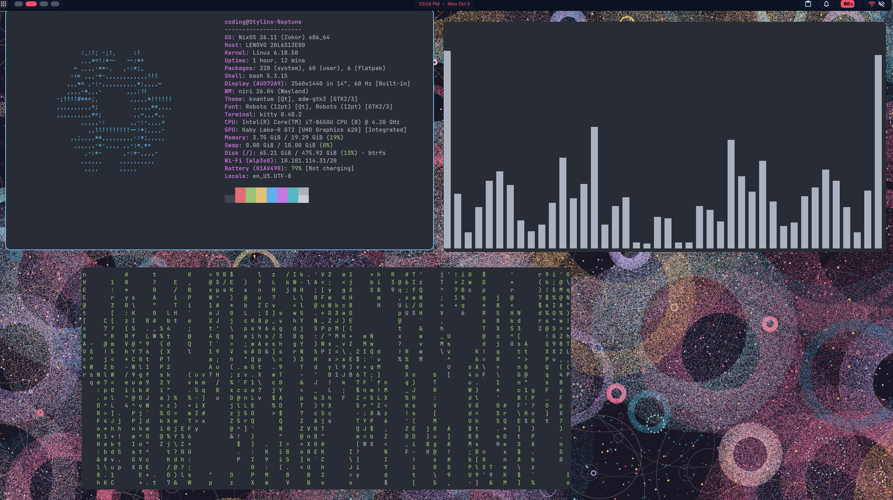
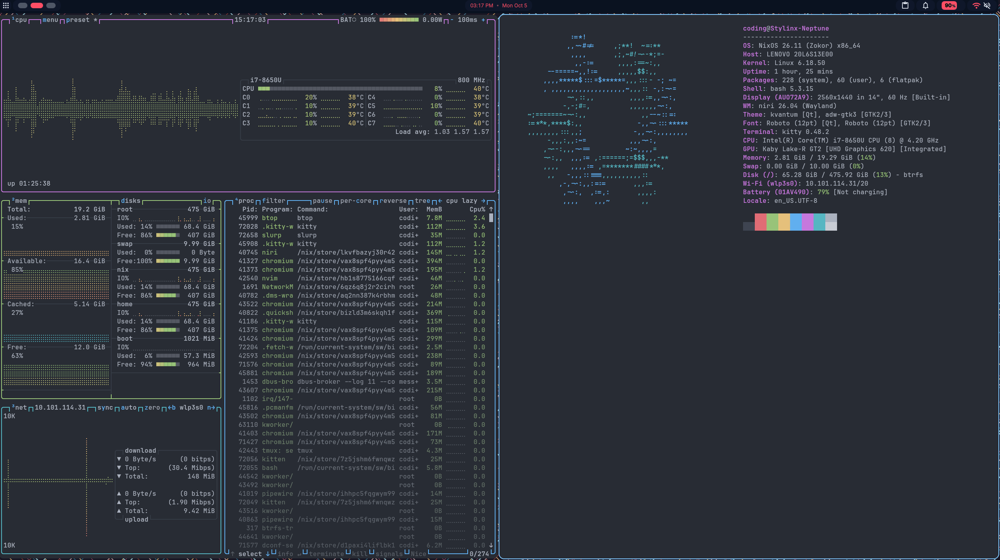
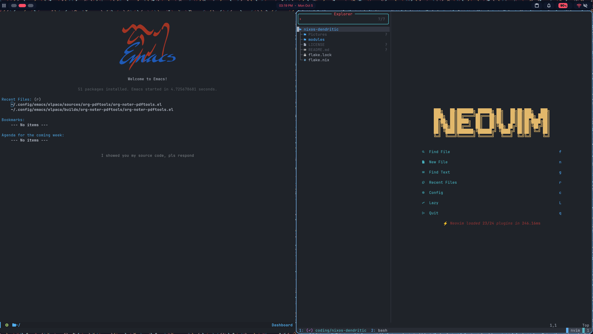

# Stylinx's NixOS Config

My NixOS configuration, built on the [dendritic pattern](https://github.com/mightyiam/dendritic): every file is a flake-parts module, and modules reference each other by **name** instead of by relative file path.

1. **Hosts:** `jupiter` and `neptune` are both laptops (HP Victus 16-s1203dx and Thinkpad T480 respectively)
2. **Home Manager:** per-user dotfiles for Emacs, Neovim, Niri, tmux, etc.
3. **Users:** different user profiles that any host can choose from

[](https://nixos.org)
[](https://github.com/mightyiam/dendritic)
[](./LICENSE)
[](https://github.com/Artemis9165/nixos)

## Why this exists

This is the better version to [Stylinx/nixos](https://github.com/Stylinx/nixos). That config used a `hosts/` / `users/` / `modules/` / `themes/` layout, and every module had to pull in its dependencies by relative path:

```nix
imports = [
  ../../modules/audio.nix
  ../../modules/desktop.nix
  ../../themes/darkmatter/default.nix
];
```
I didn't like relative file paths so I switched to the dendritic pattern.

## Hosts

| Host | Hardware |
|------|----------|
| `jupiter` | HP Victus 16-s1203dx |
| `neptune` | ThinkPad T480 |

See [`modules/hosts`](./modules/hosts) for the details of each host.

## Features

- **No relative imports**
- **Auto-loaded modules**
- **Easier Reorganization of files:** renaming or reorganizing never breaks anything
- **Mix and match:** different users can be assigned to any host
- **Declarative dotfiles:** Emacs, Neovim, Niri, tmux, etc., managed through Home Manager

## Components

| | NixOS (Wayland) |
|---|---|
| **Window Manager** | [Niri](https://github.com/YaLTeR/niri) |
| **Shell / Bar / Launcher** | [DankMaterialShell](https://github.com/AvengeMedia/DankMaterialShell) |
| **Terminal** | [Kitty](https://github.com/kovidgoyal/kitty) + [tmux](https://github.com/tmux/tmux) |
| **Shell Prompt** | [Starship](https://github.com/starship/starship) |
| **Color Scheme** | [Stylix](https://github.com/nix-community/stylix) (OneDark) |
| **Editors** | [Emacs](https://www.gnu.org/software/emacs/) (Elpaca), [Neovim](https://github.com/neovim/neovim) (lazy.nvim) |
| **System Monitor** | [btop](https://github.com/aristocratos/btop) |
| **Bootloader** | [Limine](https://limine-bootloader.org) |
| **Audio** | PipeWire, with Scarlett interface support |
| **Screen Recording** | [OBS](https://obsproject.com) |
| **Calendar** | [khal](https://github.com/pimutils/khal) + [Radicale](https://radicale.org) |
| **File Sharing** | [LocalSend](https://localsend.org) |
| **Keyboard Remapping** | [keyd](https://github.com/rvaiya/keyd) |
| **Laptop Tuning** | battery control, fan control, lid-close behavior, undervolting (`neptune`) |

## Screenshots






## Project structure

```
.
├── flake.nix                # Inputs + auto-loads everything in modules/
├── flake.lock
└── modules/
    ├── parts.nix            # Target systems + Home Manager flake module
    ├── features/
    │   ├── nixos/           # System-level features (audio, bluetooth, niri, ...)
    │   └── home/            # Home Manager features (emacs, neovim, tmux, ...)
    ├── hosts/
    │   ├── jupiter/         # HP Victus 16
    │   └── neptune/         # ThinkPad T480
    └── users/
        ├── commonImports.nix  # Home Manager modules shared by every user
        ├── coding/
        ├── creation/
        ├── general/
        └── school/
```

### Hosts

Each host is 4 files. default.nix, configuration.nix, hardware-configuration.nix, and users.nix

```nix
# modules/hosts/neptune/default.nix
{ self, inputs, ... }: {
  flake.nixosConfigurations.neptune = inputs.nixpkgs.lib.nixosSystem {
    modules = [ self.nixosModules.neptuneConfiguration ];
  };
}
```

```nix
# modules/hosts/neptune/configuration.nix
flake.nixosModules.neptuneConfiguration = { pkgs, config, ... }: {
  imports = [
    self.nixosModules.commonImports
    self.nixosModules.neptuneHardwareConfiguration
    self.nixosModules.neptuneUndervolt
    self.nixosModules.neptuneUsers
    self.nixosModules.obsStudio
    self.nixosModules.closeLaptopLid
    self.nixosModules.batteryControl
    self.nixosModules.gaming
  ];
  # host-specific settings (timezone, graphics, ...)
};
```

```nix
# modules/hosts/neptune/users.nix

{ self, inputs, ... }: {
  flake.nixosModules.neptuneUsers = { pkgs, ... }: {
    imports = [
      inputs.home-manager.nixosModules.default
      self.nixosModules.userInit
    ];
    home-manager.users = {
      coding = self.homeModules.userConfiguration;
    };
  };
}
```

### Users

```nix
# modules/users/general/configuration.nix
{ self, inputs, ... }: {
  flake.nixosModules.generalInit = { pkgs, ... }: {
    users.users.general = {
      isNormalUser = true;
      extraGroups = [ "wheel" "networkmanager" "video" "render" ];
    };
  };
  flake.homeModules.generalConfiguration = { pkgs, ... }: {
    imports = [ self.homeModules.commonImports ];
    programs.bash.enable = true;
    home.stateVersion = "26.05";
  };
}
```

```nix
# modules/hosts/neptune/users.nix
flake.nixosModules.neptuneUsers = { pkgs, ... }: {
  imports = [
    inputs.home-manager.nixosModules.default
    self.nixosModules.codingInit
    self.nixosModules.generalInit
    self.nixosModules.schoolInit
  ];
  home-manager.users = {
    coding = self.homeModules.codingConfiguration;
    general = self.homeModules.generalConfiguration;
    school = self.homeModules.schoolConfiguration;
  };
};
```

## Installation

> **Important:** don't deploy this flake directly on your machine. It contains
> different hardware configuration and settings for
> my own hosts, so it won't work with your hardware. Use it as a reference to build your own
> configuration.

If you do want to build it on matching hardware:

### Prerequisites

- A machine running NixOS
- [Flakes enabled](https://wiki.nixos.org/wiki/Flakes)
- Git

### Build

```bash
# Clone the repository
git clone https://github.com/Artemis9165/nixos-dendritic.git
cd nixos-dendritic

# Build and switch (pick your host)
sudo nixos-rebuild switch --flake .#jupiter
sudo nixos-rebuild switch --flake .#neptune
```

If adapting this for different hardware, generate your own `hardware-configuration.nix` with `nixos-generate-config`.

## Usage

### Adding a new feature

1. Create a new file in `modules/features/nixos/` (or `home/`)
2. Define it as `flake.nixosModules.<name>` (or `flake.homeModules.<name>` for Home Manager)
3. Reference it as `self.nixosModules.<name>` (or `self.homeModules.<name>`) from whichever host or user should use it

### Common commands

| Command | Purpose |
|---------|---------|
| `sudo nixos-rebuild switch --flake .#<host>` | Build and activate the config |
| `sudo nixos-rebuild test --flake .#<host>` | Activate without making it the boot default |
| `nix flake update` | Update all flake inputs |
| `nix flake check` | Check the flake for errors |

## References

- [mightyiam/dendritic](https://github.com/mightyiam/dendritic) for documenting the pattern
- [flake-parts](https://flake.parts) and [import-tree](https://github.com/vic/import-tree) for making it work
- [ryan4yin/nix-config](https://github.com/ryan4yin/nix-config) for README inspiration
- [Artemis9165/nixos](https://github.com/Artemis9165/nixos), my previous path-import-based config

## License

This project is licensed under the [MIT License](./LICENSE).
